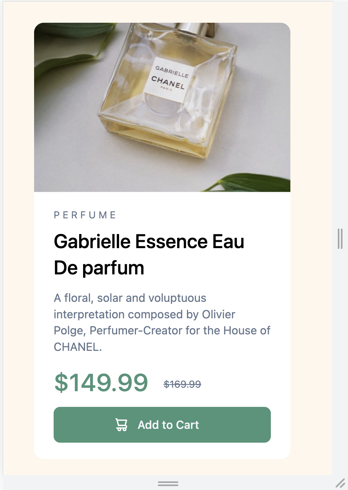

# Frontend Mentor - Product preview card component solution

This is a solution to the [Product preview card component challenge on Frontend Mentor](https://www.frontendmentor.io/challenges/product-preview-card-component-GO7UmttRfa). Frontend Mentor challenges help you improve your coding skills by building realistic projects. 

## Table of contents

- [Overview](#overview)
  - [The challenge](#the-challenge)
  - [Screenshot](#screenshot)
  - [Links](#links)
- [My process](#my-process)
  - [Built with](#built-with)
  - [Description](#what-i-learned)
- [Author](#author)

## Overview

### The challenge

Users should be able to:

- View the optimal layout depending on their device's screen size
- See hover and focus states for interactive elements

### Screenshot

### Links
You can view the end result via the following link
- URL: [sanderdechering.github.io/Frontend-Mentor_product-preview-card](https://sanderdechering.github.io/Frontend-Mentor_product-preview-card/)

## My process

### Built with

- [Semantic HTML5 markup](https://css-tricks.com/how-to-section-your-html/#dont-swap-div-for-a-section)
- [Tailwind CSS](https://tailwindcss.com/)

### Description

This project is my first project on frontendmentor.io. This project served as a learning process in how frontend mentor and it's concept works.

The product card was created using Tailwind CSS and default HTML, no javascript. The colors are not 1 to 1, as I have used basic tailwind colors. No fonts were added.

## Author

- Website - [Add your name here](https://www.sanderdechering.nl)
- Frontend Mentor - [@yourusername](https://www.frontendmentor.io/profile/yourusername)
- Twitter - [@yourusername](https://www.twitter.com/yourusername)
